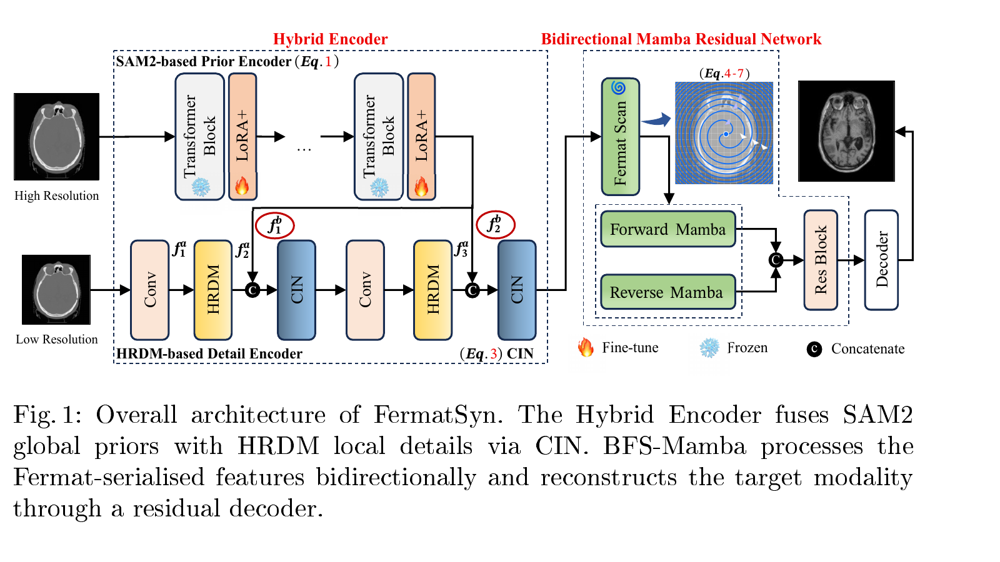

# FermatSyn



**FermatSyn** is a SAM2-enhanced bidirectional Mamba framework for multi-modal medical image synthesis. It combines anatomical priors, high-frequency detail reconstruction, and isotropic Fermat spiral scanning to improve structural fidelity and cross-modal consistency.

📄 **Paper:** [FermatSyn on arXiv](https://arxiv.org/abs/2505.07687) · 🧪 **MICCAI 2026**

Official code release for the MICCAI version of **FermatSyn: SAM2-Enhanced Bidirectional Mamba with Isotropic Spiral Scanning for Multi-Modal Medical Image Synthesis**.

FermatSyn is a paired medical-image translation framework combining a frozen SAM2 visual prior, a high-resolution detail branch, and a bidirectional Mamba sequence model whose feature serialization follows a continuity-constrained Fermat spiral.

## Scope

The repository contains the minimal reproducible execution unit: the SAM2-enhanced hybrid encoder, BFS-Mamba blocks, dynamic Fermat scanning, paired volume-window loading, training/evaluation entry points, and the MICCAI paper source under `paper/`. Dataset files, patient data, checkpoints, generated results, and cluster launch scripts are intentionally excluded.

## Method at a glance

1. **SAM2-enhanced hybrid encoder:** frozen SAM2 features plus LoRA+ adaptation are fused with a high-resolution detail branch.
2. **Continuity-constrained Fermat scanning:** feature maps are serialized with a golden-angle Fermat spiral; the reported configuration uses `lambda_c = 0.7`.
3. **BFS-Mamba:** forward and reverse sequences are processed independently, then restored with reverse flip-back, exact inverse permutation, and position-wise aligned-mean fusion.

The reported generator objective uses LSGAN with `lambda_L1 = 100`, `lambda_SSIM = 10`, and `lambda_gan = 1`.

The current run identity is the dynamic full-candidate serializer with:

```text
--scan_use_multipath
--scan_name fermat
--scan_K 1
--scan_lambda_c 0.7
```

The executable graph includes reverse flip-back, exact inverse permutation, and position-wise aligned-mean fusion.

## Reported evaluation

The paper evaluates merged BraTS intra-modal synthesis, SynthRAD2023 MRI↔CT synthesis, and downstream tumour segmentation using synthetic T2w/T2f images. It also reports BraTS2019, BraTS-MEN, and BraTS-MET experiments.

Selected paper results include SynthRAD2023 MRI→CT SSIM 0.931, PSNR 31.48 dB, FID 46.7; BraTS T2w→T1c PSNR 29.78 dB; and downstream T1n→T2w WT/ET/TC Dice of 0.847/0.762/0.785. These are paper results; the repository does not ship the underlying clinical data or pretrained checkpoints.

The paper source is `paper/paper-3777.tex`; compile it from that directory with a standard LaTeX environment.

## Paper and citation

The MICCAI manuscript source is [`paper/paper-3777.tex`](paper/paper-3777.tex), with bibliography and EPS figure sources in the same directory.

```bibtex
@inproceedings{yuan2026fermatsyn,
  title     = {FermatSyn: SAM2-Enhanced Bidirectional Mamba with Isotropic Spiral Scanning for Multi-Modal Medical Image Synthesis},
  author    = {Yuan, Feng and Gao, Yifan and Li, Haoyue and Gao, Xin},
  booktitle = {Medical Image Computing and Computer Assisted Intervention},
  year      = {2026}
}
```

## Install

```bash
python -m venv .venv
source .venv/bin/activate
pip install -r requirements.txt
```

The SAM2 checkpoint is not redistributed. Download it separately when the selected configuration requires it:

```bash
wget https://dl.fbaipublicfiles.com/segment_anything_2/072824/sam2_hiera_large.pt
```

## Run

Use `train_a2.py` for training and `evaluate_frozen_3tap.py` for evaluation. Both scripts expose `--help`; dataset paths and output directories must be supplied for a local dataset.

```bash
python train_a2.py --help
python evaluate_frozen_3tap.py --help
```

## Smoke check

The minimal import smoke check is:

```bash
python -m compileall -q .
python -c "from models.a2_context import InterSliceContextModulator; from models.a2_spatial import SUPPORTED_INPUT_MODES; print(sorted(SUPPORTED_INPUT_MODES))"
```

The checked-in tests include historical dataset/checkpoint cases and therefore require local medical data, SAM2 weights, and the optional dependencies listed in `requirements.txt`.

## License

The repository is released under the MIT License. See `LICENSE`.
